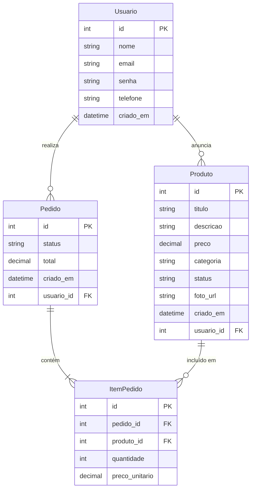

# Diagrama ER — Express Commerce

```mermaid
erDiagram
    Usuario {
        int id PK
        string nome
        string email
        string senha
        string telefone
        datetime criado_em
    }

    Produto {
        int id PK
        string titulo
        string descricao
        decimal preco
        string categoria
        string status
        string foto_url
        datetime criado_em
        int usuario_id FK
    }

    Pedido {
        int id PK
        string status
        decimal total
        datetime criado_em
        int usuario_id FK
    }

    ItemPedido {
        int id PK
        int pedido_id FK
        int produto_id FK
        int quantidade
        decimal preco_unitario
    }

    Usuario ||--o{ Produto : "anuncia"
    Usuario ||--o{ Pedido : "realiza"
    Pedido ||--|{ ItemPedido : "contém"
    Produto ||--o{ ItemPedido : "incluído em"
```
