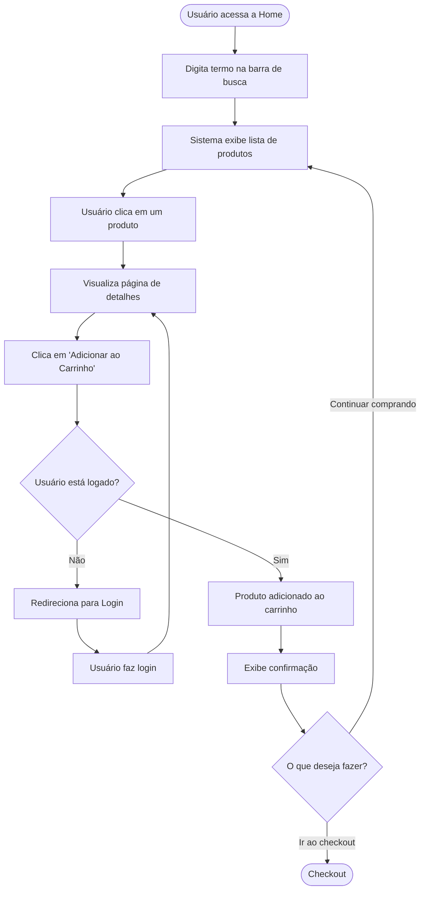

# Diagrama de Fluxo — Jornada do Usuário — Express Commerce

```mermaid
flowchart TD
    A([Usuário acessa a Home]) --> B[Digita termo na barra de busca]
    B --> C[Sistema exibe lista de produtos]
    C --> D[Usuário clica em um produto]
    D --> E[Visualiza página de detalhes]
    E --> F[Clica em 'Adicionar ao Carrinho']
    F --> G{Usuário está logado?}
    G -- Não --> H[Redireciona para Login]
    H --> I[Usuário faz login]
    I --> E
    G -- Sim --> J[Produto adicionado ao carrinho]
    J --> K[Exibe confirmação]
    K --> L{O que deseja fazer?}
    L -- Continuar comprando --> C
    L -- Ir ao checkout --> M([Checkout])
```
